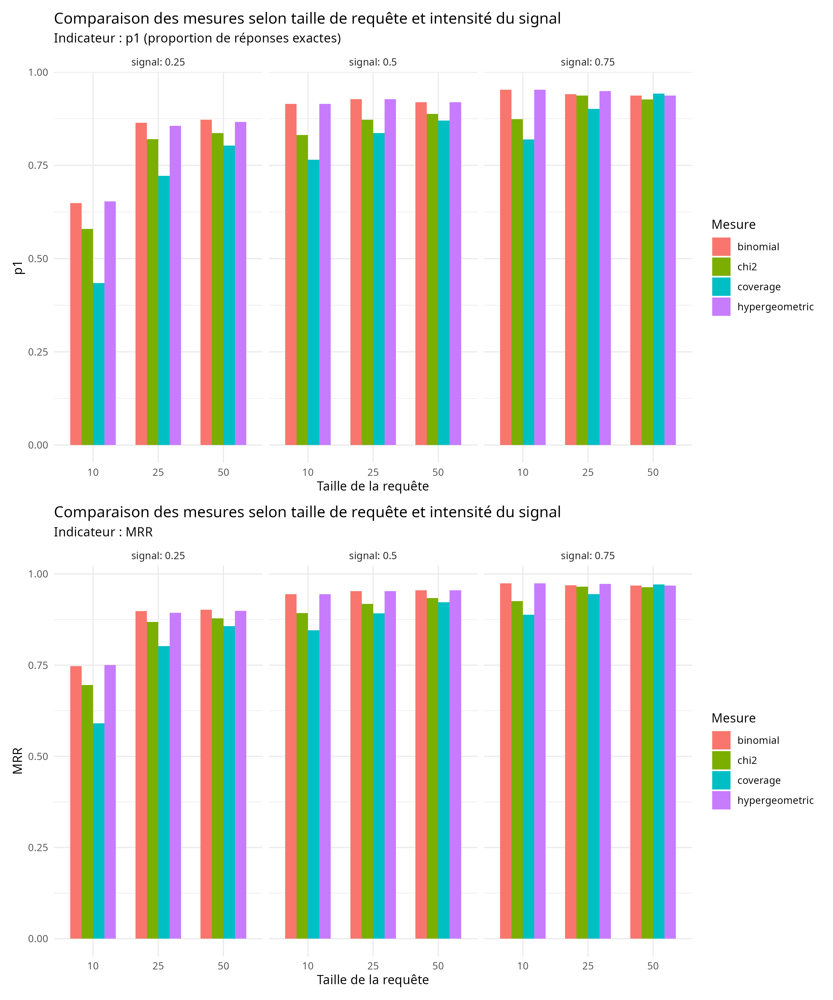
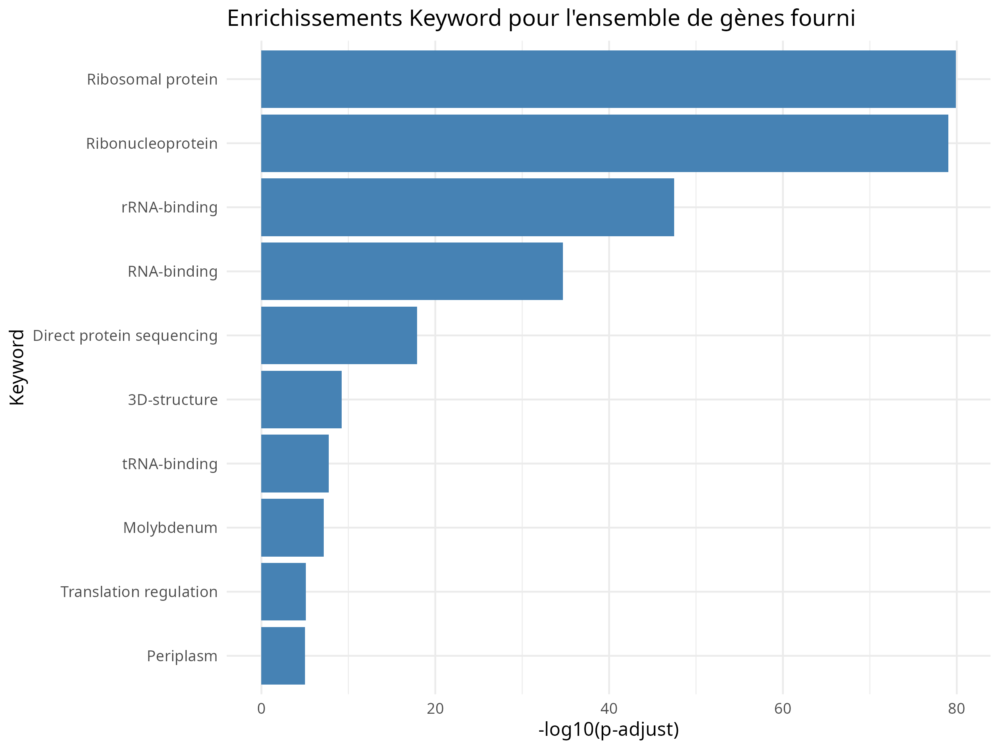
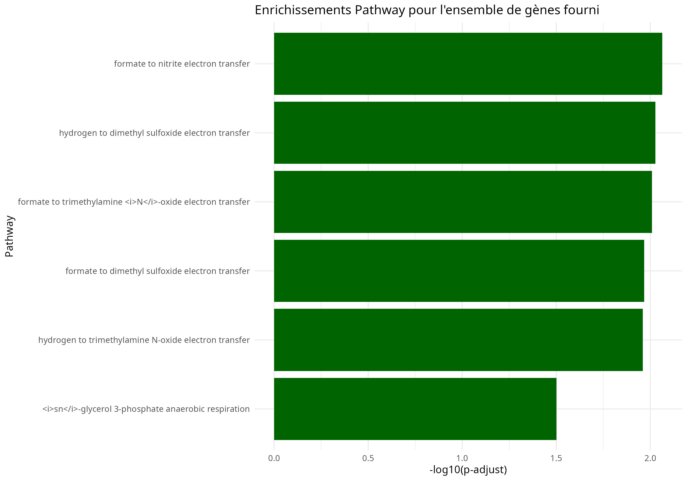
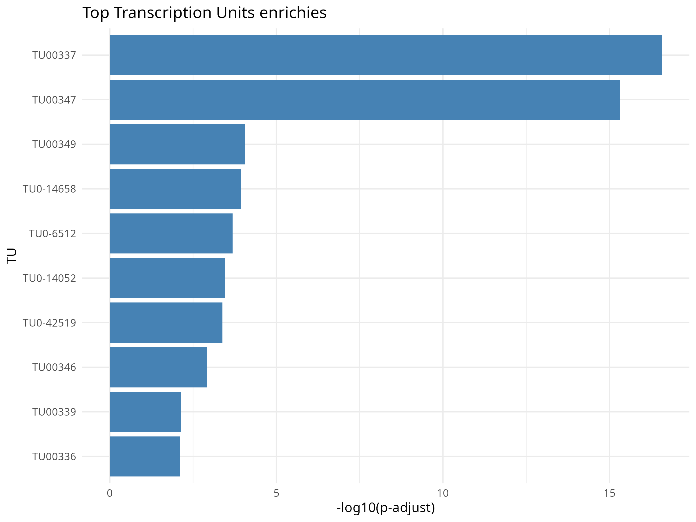
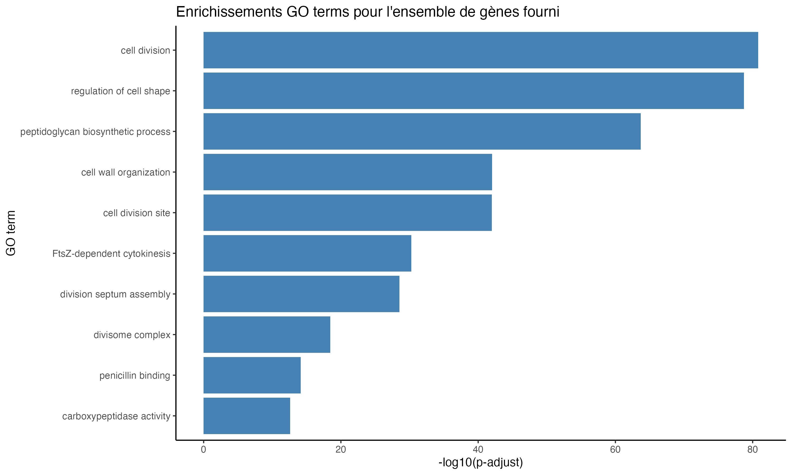
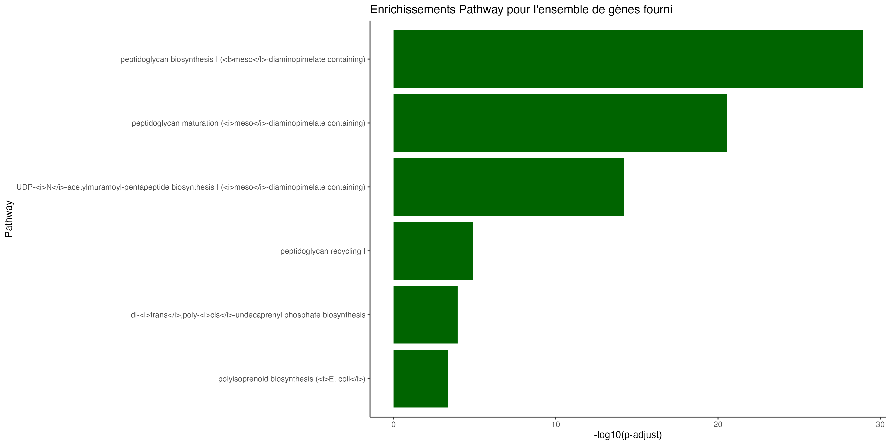

# Analyse d’Enrichissement Fonctionnel

## Contexte

L’analyse s’appuie sur une base de données intégrée construite sous Neo4j, regroupant des annotations fonctionnelles (GO, InterPro), des pathways, des unités transcriptionnelles, des mots-clés UniProt, des références PubMed et des interactions protéine-protéine. Ces données organisées sous forme de graphe permettent d’interroger efficacement les relations entre gènes et catégories biologiques. Un script d’enrichissement a été étendu afin d’évaluer plusieurs mesures statistiques (hypergéométrique, binomiale, χ², coverage) et d’identifier celle offrant les résultats les plus pertinents pour caractériser les ensembles de gènes étudiés.

##  Présentation du projet

Ce projet consiste en une analyse d’enrichissement fonctionnel de deux ensembles de gènes bactériens (`set.M2.14.txt` et `set.02.txt`) afin d’identifier les fonctions biologiques, motifs protéiques, mots-clés, voies métaboliques et unités transcriptionnelles surreprésentés.  
L’objectif est de caractériser chaque ensemble et de comprendre leurs rôles biologiques spécifiques.

---
# Comparaison des mesures intégrées

Plusieurs mesures (hypergéométrique, binomiale, χ² et coverage) ont été comparées afin d’évaluer leur capacité à détecter correctement les catégories enrichies. Les tests ont montré que la mesure hypergéométrique est celle qui fournit les résultats les plus stables et les plus cohérents, même dans des scénarios difficiles. Elle correspond également à la méthode classiquement utilisée en biologie pour les analyses d’enrichissement.
La mesure binomiale donne des performances proches et peut servir d’alternative simple ou de validation complémentaire. En revanche, les approches χ² et coverage se sont révélées moins adaptées en raison d’une variabilité plus importante ou d’une sensibilité excessive au bruit.
Nous retenons donc l’hypergéométrique comme mesure principale pour l’analyse fonctionnelle.

**Figure 6** : Comparaison des mesures intégrées

# Analyse de l’ensemble de gènes fourni

### A. Ensemble `set.M2.14.txt`

#### 1.1 GOTerm
Les gènes de l’ensemble sont fortement enrichis pour des fonctions liées à la **traduction** : cytoplasmic translation, structural constituent of ribosome, rRNA binding et translation, avec des p-values très faibles. La majorité des gènes codent pour des protéines ribosomales et des facteurs de traduction, avec des processus secondaires liés à l’assemblage des sous-unités ribosomales.  

**Figure 7** : Enrichissements des termes GO 

#### 1.2 InterPro
Enrichissement marqué pour la **voie de translocation Twin-arginine**, les domaines **molybdopterin oxidoreductase** et les sous-unités **[NiFe]-hydrogenase**. Les protéines ribosomales sont également sur-représentées, soulignant la combinaison traductionnelle et métabolique spécialisée, notamment la respiration anaérobie.  

**Figure 8** : Enrichissements des domaines protéiques InterPro

#### 1.3 Keyword
Les mots-clés enrichis incluent **Ribosomal protein**, **RNA-binding**, **tRNA-binding**, ainsi que **Molybdenum**, **4Fe-4S**, **Oxidoreductase**. Cette combinaison montre un ensemble de gènes centré sur la traduction mais incluant un sous-ensemble impliqué dans le métabolisme énergétique et la respiration anaérobie.  

**Figure 9** : Enrichissements des mots-clés fonctionnels

#### 1.4 Pathway
Les voies enrichies concernent des transferts d’électrons spécifiques : hydrogène → triméthylamine N-oxyde / diméthylsulfoxyde, formate → ces accepteurs / nitrite, respiration anaérobie du sn-glycérol 3-phosphate.  

**Figure 10** : Enrichissements des voies métaboliques (Pathway)

#### 1.5 Transcription Units (TU)
Plusieurs TU regroupent des gènes ribosomaux (TU00337, TU00347), tandis que d’autres contiennent des gènes liés à la respiration anaérobie et au transport Tat. Cela indique une régulation transcriptionnelle coordonnée.  

**Figure 11** : Enrichissements des unités de transcription (TU)

**Discussion :** L’ensemble `set.M2.14.txt` présente un profil centré sur la traduction, avec un sous-ensemble spécialisé dans la respiration anaérobie. Les analyses GOTerm et Keyword mettent en évidence la machinerie de traduction, InterPro et Pathway identifient les modules métaboliques spécialisés, et les TU illustrent la régulation coordonnée.

---

### B. Ensemble `set.02.txt`

#### 1.1 GOTerm
Les termes GO les plus enrichis sont **cell division**, **regulation of cell shape**, **peptidoglycan biosynthetic process**, indiquant une sur-représentation des gènes participant à la division cellulaire et à la construction de la paroi bactérienne.  

**Figure 12** : Enrichissements GO Terms de `set.02.txt`

#### 1.2 InterPro
Les domaines InterPro enrichis appartiennent aux **transpeptidases**, **L,D-transpeptidases** et **Mur ligases**, caractéristiques de la biosynthèse et du remodelage du peptidoglycane. Les **penicillin-binding proteins (PBPs)** sont également représentées.  

**Figure 13** : Enrichissements InterPro de `set.02.txt`

#### 1.3 Keyword
Les mots-clés enrichis confirment la forte implication dans la **division cellulaire** et la **morphologie bactérienne**, avec des termes liés à la synthèse et au remodelage du peptidoglycane.  

**Figure 14** : Enrichissements Keyword de `set.02.txt`

#### 1.4 Pathway
Les voies enrichies concernent exclusivement la **biosynthèse et la maturation du peptidoglycane**, notamment la voie meso-diaminopimelate contenant, typique des bactéries Gram-négatives.  

**Figure 14** : Enrichissements Pathway de `set.02.txt`

#### 1.5 PubMed
Les publications enrichies portent sur la **division cellulaire bactérienne**, la **cytokinèse**, la formation du divisome, et la régulation transcriptionnelle des opérons **dcw** et **mra**.  

**Figure 15** : Enrichissements PubMed de `set.02.txt`

**Discussion :** L’ensemble `set.02.txt` présente une signature centrée sur la **division cellulaire**, le **divisome**, et la **synthèse du peptidoglycane**. Les analyses convergent vers un module génétique cohérent impliqué dans le maintien de la morphologie et la coordination entre division cellulaire et biosynthèse de la paroi.

---

##  Conclusion générale

- **`set.M2.14.txt`** : profil traductionnel + métabolisme anaérobie.  
- **`set.02.txt`** : profil division cellulaire + biosynthèse peptidoglycane.  

Ces deux ensembles illustrent comment les analyses fonctionnelles permettent de découvrir des modules biologiques cohérents et de relier les gènes à des fonctions et voies spécifiques dans le génome bactérien.

## **Auteurs** 
**Hawa BALDE**  
**Issa KERIMA-KHALIL**

Master Bioinformatique et Biologie des Systèmes  
Université Toulouse Paul Sabatier 2025-2026
